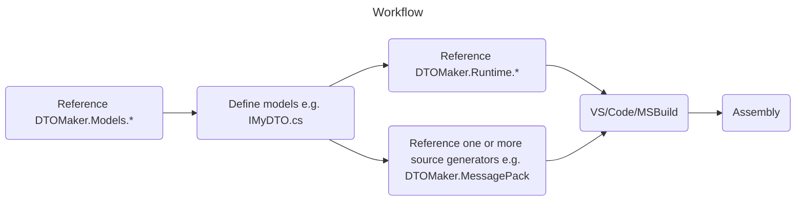

# DTOMaker

[](https://github.com/datafac/dtomaker-json/actions/workflows/dotnet.yml)
[](https://github.com/datafac/dtomaker-json/actions/workflows/github-code-scanning/codeql)


*Warning: This is pre-release software under active development. Breaking changes may occur.*

A collection of model-driven compile-time source generators for quickly creating DTOs (Data Transport Objects) supporting the following
serialization schemes:
- JSON

and related types.


## Workflow


Models are defined as C# interfaces with additional attributes. Here's a trivial example:

```C#
[Entity][Id(1)]
public interface IMyFirstDTO
{
    [Member(1)] string Name { get; set; }
}
```
If using the MessagePack source generator, the following implmentation will be 
generated (simplified):

```C#
[MessagePackObject]
public sealed class MyFirstDTO : EntityBase, IMyFirstDTO, IEquatable<MyFirstDTO>
{
    [Key(1)] string Name { get; set; }
}
```
# Included Packages

This repo includes the following packages:

## DTOMaker.JsonSystemText
A source generator that creates DTOs (Data Transport Objects) that are serializable to JSON.

## DTOMaker.Runtime
Common types used at runtime by DTOMaker generated entities.

# Model features
- Member value types: Boolean, S/Byte, U/Int16/32/64/128, Double, Single, Half, Char, Guid, Decimal
- String member types
- Binary member types (Octets)
- polymorphic types
- generic types
- entity members
- Built-in freezability (mutable until frozen) support
- [Obsolete] members
- Fixed length arrays of above value types.
- IEquatable\<T\> support
- Templates as testable code, template-to-generator processing.

## MemBlocks features
- auto-embedded string, binary and entity members when encoded < 63 bytes.
- fixed-length string and binary member types.

# !Limitations
## Single compilation unit
All models and generated DTOs are contained within a single assembly.
Models cannot reference types in other projects or packages (other 
than native or built-in types). Generated classes are partial, which can help you 
mitigate the single assembly constraint.

# Development
## In progress
- custom struct members (to avoid primitive obsession)

## Coming soon
- Json (System.Text) generator
- upgrade source generators to IIncrementalGenerator
- global interface equality comparer
- reservation (hidden members)
- Orleans generator
- ProtobufNet 3.0 generator
- MessagePack 3.x generator
- NetStrux generator
- MemBlocks compact layout method
- Enum data types. Workaround - enums can be implemented with an underlying 
  integer property and a cast.
- MemBlocks nullable types. Workaround - T? can be implemented with a pair
  of members (Boolean, T).

## Coming later
- Google Protobuf .proto generation
- model.json generation
- command-line alternative
- variable length arrays
- logical value equality
- Rune member types
